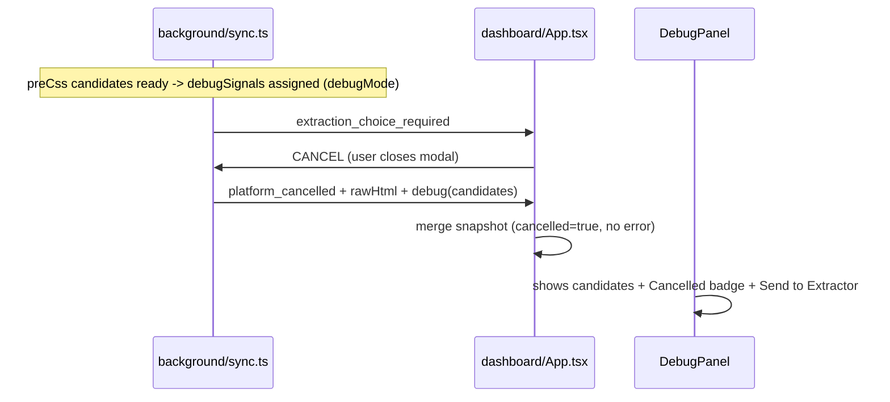

# Fix Review Findings: Debug Cancel Flow

## Context

Follow-up to the "Preserve Debug Logs on Cancel" work. The cancel path now keeps logs + HTML, but extraction candidates are missing, and a couple of polish items remain.

## Finding M1 (Medium): Partial `debugSignals` missing on cancel

### Root cause
`debugSignals`, `rawHtml`, `rawLoginHtml` are declared before the `try` (so they survive into `catch`):

```755:757:src/background/sync.ts
  let debugSignals: DebugSignalResult[] | undefined;
  let rawLoginHtml: string | undefined;
  let rawHtml: string | undefined;
```

But `debugSignals` is only assigned near the end of the `try` (after both signals fully resolve, ~line 1854). The CSS candidate pools `preCssPortfolio` / `preCssFreeCash` are computed earlier (lines 1464+, populated ~1660) but live inside the `try`. So when the user cancels at the value-selection modal (`waitForExtractionChoice` rejects with `CancelledError` via `resolveSignalSelection`, lines 690-698), the outer `debugSignals` is still `undefined` and the cancel event carries no candidates. This is exactly the Estate-Guru case ("der richtige Value ist nicht in der Auswahl").

### Fix
Assign a preliminary `debugSignals` to the outer variable as soon as the CSS candidate pools are available (right after the pre-CSS telemetry block, before the `resolveSignalSelection` calls at line 1691), guarded by `debugMode`:

- Build from `preCssPortfolio` / `preCssFreeCash` using the existing `buildDebugSignal(key, signalSelectors(platform, key), result)` helper ([src/background/sync/debug-logger.ts](src/background/sync/debug-logger.ts) line 76).
- The existing final assignment (~line 1854, which uses the resolved `portfolioValue`/`freeCash` + `aiLogs`) still overwrites it on the success path, so no behavior change when no cancel occurs.

Result: on cancel during selection, `platform_cancelled` already includes `debug` (the CSS candidate list) via the existing `...(debugSignals ? { debug: debugSignals } : {})` in the cancel branch. The Debug tab's `SignalSection` then renders the candidates the user was choosing between.

## Finding L1 (Low): `error` not cleared on cancel

In [src/dashboard/App.tsx](src/dashboard/App.tsx), the cancel branch spreads `...existing` (which can carry a prior `error`) and only adds `cancelled: true`. Since `PlatformSection` treats `isFailed = Boolean(snapshot.error)` with priority over `isCancelled`, a stale error would show "Failed" instead of "Cancelled".

### Fix
In the `platform_cancelled` branch, build the snapshot without `error`:

```ts
if (event.type === "platform_cancelled") {
  const snapshotCancelled = { ...nextSnapshot, cancelled: true };
  delete (snapshotCancelled as any).error;
  upsertDebugSnapshot(snapshotCancelled as DebugPlatformSnapshot);
}
```

## Finding I1 (Info): German label to English

[src/dashboard/components/DebugPanel.tsx](src/dashboard/components/DebugPanel.tsx) line ~398: `An Extractor senden` violates the AGENTS.md English-UI rule. Change to `Send to Extractor`. No test asserts this string (verified: only occurrence is in the component), and the transfer buttons are targeted by `data-testid`, so tests are unaffected.

## Finding I2 (Info): 4-minute timeout - keep

`PLATFORM_SYNC_TIMEOUT_MS = 4 * 60_000` is intentional. No code change; just call it out in the commit/summary so it is not mistaken for an accidental edit. The existing test already expects 4 minutes ([tests/unit/sync-debug-html.test.ts](tests/unit/sync-debug-html.test.ts) ~line 504).

## Findings L2 and L3: no code change (documented rationale)

- L2: `runSync`'s top-level catch emits `platform_cancelled` without HTML for platforms that never started (~line 2091). Correct - no HTML exists for them.
- L3: `shouldTrackDebug` skips cancel events with no HTML only when debug mode is off; in the debug troubleshooting workflow `debugMode` is always on, so cancel is tracked. No change needed.

## Tests

- [tests/unit/sync-debug-html.test.ts](tests/unit/sync-debug-html.test.ts): extend the existing "includes captured HTML in platform_cancelled" test to lock down the cancel point and guard the preliminary-`debugSignals` fix specifically:
  - Pin the cancel to the FIRST `waitForExtractionChoice` call. Drive this so the cancel happens during the first signal's selection wait, before the second signal resolves - e.g. `waitForExtractionChoiceMock.mockRejectedValueOnce(new CancelledError(...))` so only the first invocation rejects (and assert `waitForExtractionChoiceMock` was called exactly once, proving the second signal never reached its own wait).
  - Make `extractSignalFromTab` return non-empty `allCandidates` for both `portfolio_value` and `free_cash` so the pre-CSS pools are populated before the wait.
  - Assert `platform_cancelled.debug` is present and contains BOTH signals (`portfolio_value` AND `free_cash`), each with their candidate list - even though cancel fired at the first `waitForExtractionChoice`. This fails if `debugSignals` is only assigned after both signals fully resolve (the old behavior), so it directly protects the preliminary assignment.
  - Keep the existing `rawLoginHtml` / `rawHtml` assertions in the same test.
- [tests/unit/dashboard-bootstrap.test.ts](tests/unit/dashboard-bootstrap.test.ts): add a case where a snapshot has a prior `error`, then a `platform_cancelled` event arrives, and assert the resulting snapshot has `cancelled: true` and no `error`.

## Version bump

Bump `version` in [manifest.json](manifest.json) (`0.12.111` -> `0.12.112`) and keep [package.json](package.json) in sync.

## Flow after fix


