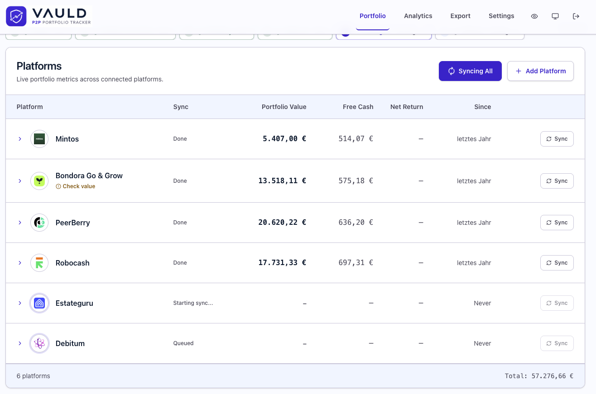
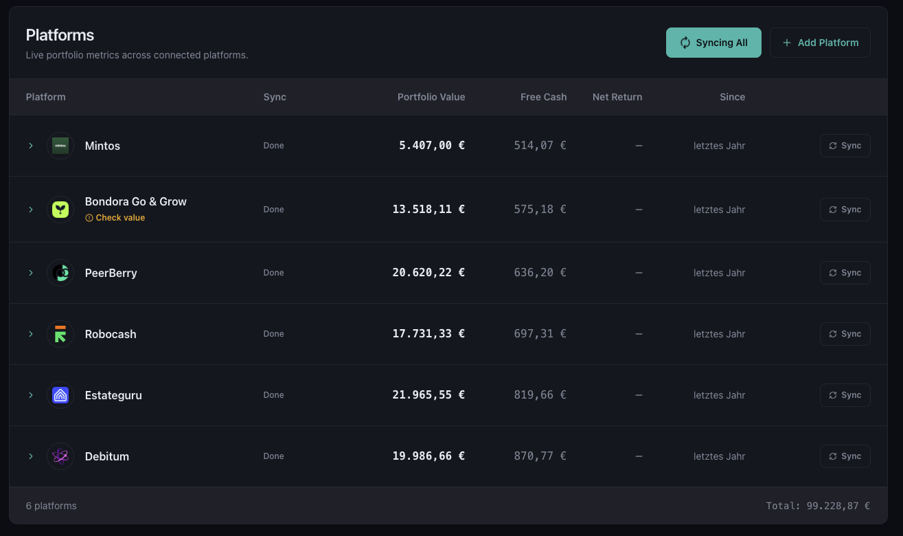
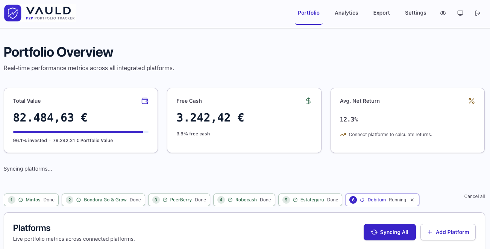
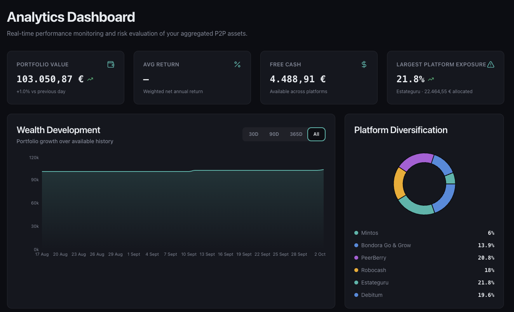
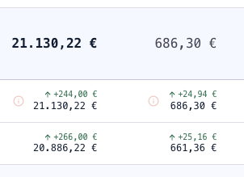

# P2P Vauld

**Privacy-first Chrome extension that aggregates your P2P lending portfolios.**
Auto-login, sync balances, and visualize your investments across 59 P2P lending platforms. All data stays in your browser, always.

Official website: [https://vauld.de](https://vauld.de)

<p align="center">
  
  
  
  
  
</p>

<p align="center">
  
</p>

## Jumpmarks

- [Highlights](#highlights)
- [Screenshots](#screenshots)
- [Security \& Privacy](#security--privacy)
- [How It Works](#how-it-works)
- [Supported Platforms](#supported-platforms)
- [Supported Browsers](#supported-browsers)
- [Installation](#installation)
- [Development](#development)
- [Demo Mode](#demo-mode)
- [Tech Stack](#tech-stack)
- [Contributing](#contributing)
- [Author](#author)
- [License](#license)

## Highlights

- **59 P2P platforms** in one unified dashboard
- **1-click sync** — logs in and extracts portfolio data automatically, sequentially by default or with an optional two-platform parallel mode
- **100% Local. Zero Cloud** — financial data and settings stay in browser storage, with no backend or telemetry
- **credential encryption** — credentials are protected with AES-256-GCM and PBKDF2 key derivation (310k iterations), using only the native Web Crypto API
- **Free Cash Finder** — surfaces uninvested cash per platform so you can minimize cash drag
- **Analytics dashboard** — historical charts, KPI cards, return metrics with gapless history
- **Dark mode and privacy blur** — privacy blur hides sensitive values
- **Data export** — CSV overview and JSON backup with validate & restore
- **On-device AI** — optional Gemini Nano (Chrome Prompt API) extraction, never sends data externally

---

## Screenshots

<details>
<summary>Click to expand the screenshot gallery</summary>

<br>

<p align="center">
  
</p>

<p align="center">
  
</p>

<p align="center">
  
</p>

<p align="center">
  
</p>

</details>

---

## Security & Privacy

P2P Vauld is built on an uncompromising local-only architecture. It has no backend, analytics, or tracking, and sends no data to P2P Vauld, cloud AI services, or other third parties. During a sync, the extension communicates only with the P2P platforms you configured, just as a normal browser login would.

| Principle | Implementation |
|---|---|
| **Credential encryption** | Usernames and passwords are encrypted with AES-256-GCM via the browser's native [Web Crypto API](https://developer.mozilla.org/en-US/docs/Web/API/Web_Crypto_API) |
| **Key derivation** | PBKDF2 with SHA-256 and 310,000 iterations |
| **No external crypto libs** | Zero third-party crypto dependencies |
| **Encryption modes** | Master password or browser-bound invisible key; the master password provides stronger protection against access to the local Chrome profile |
| **Local storage** | Encrypted credentials, financial history, and settings are stored locally using IndexedDB, `chrome.storage.local`, and temporary `chrome.storage.session` state |
| **AI extraction** | On-device only via Chrome's built-in Gemini Nano — page content never leaves the browser |
| **Secret scanning** | `pnpm scan:sensitive` blocks real platform captures, personal data, and auth traces in Git hooks and CI |

Financial metrics and history are stored locally but are not encrypted. Privacy Mode masks financial values in the user interface; it does not encrypt the underlying portfolio data.

See the [Privacy Policy](https://vauld.de/privacy/) for the complete data-handling and Chrome Web Store Limited Use disclosures.

---

## How It Works

1. **Add your platforms** — select from 59 supported European P2P lending platforms and enter your credentials. They are encrypted before being stored locally.
2. **Choose your encryption mode** — use a master password for stronger protection or a browser-bound invisible key for automatic unlocking. The master password itself is never stored.
3. **Sync with one click** — P2P Vauld opens a dedicated popup window for each platform, logs in, extracts Portfolio Value, Free Cash, and Net Annual Return, and stores the results locally. Sync is sequential by default; an optional setting allows up to two platforms to run in parallel.

That's it. Your dashboard shows a unified view of all your P2P investments with historical analytics, and you can export the data any time as CSV or JSON backup.

Sync windows initially open unfocused and are minimized after the first page load. Safe Mode keeps a platform window visible after login failures, while Stealth Mode adds more human-like timing. If a platform requests 2FA or a Captcha, P2P Vauld brings the window into view for manual action and continues the remaining sync queue. When a platform is unavailable or times out, the dashboard retains its last known value instead of replacing it with zero.

---

## Supported Platforms

<details>
<summary>View all 59 supported platforms</summary>

<br>

| Platform | Domains |
|---|---|
| Mintos | mintos.com |
| Bondora Go & Grow | goandgrow.eu, app.goandgrow.eu, sso.bondora.com |
| PeerBerry | peerberry.com |
| Robocash | robo.cash |
| Twino | twino.eu |
| Estateguru | estateguru.com, estateguru.co, app.estateguru.co, beta.estateguru.co, auth.estateguru.co |
| Debitum | debitum.investments |
| Esketit | esketit.com |
| Viainvest | viainvest.com, dashboard.viainvest.com |
| Nectaro | nectaro.eu |
| Afranga | afranga.com |
| Asterra Estate | asterra.estate |
| Devon | devon.eu |
| FF Forest | ff-forest.com |
| Ventus Energy | ventus.energy |
| Indemo | indemo.eu, app.indemo.eu |
| InRento | inrento.com |
| Crowdpear | crowdpear.com |
| Income | getincome.com |
| Lande | lande.co, app.lande.finance, invest.lande.finance |
| Capitalia | capitalia.com |
| Fintown | fintown.eu, www.fintown.eu, account.fintown.eu |
| Monefit SmartSaver | monefit.com, smartsaver.monefit.com |
| MyPeak Finance | mypeak.finance |
| Triple Dragon Funding | tdfunding.eu, www.tdfunding.eu |
| InSoil Finance | finance.insoil.com, app.insoil.com |
| Bondster | bondster.com |
| Crowdestor | crowdestor.com |
| Lendermarket | lendermarket.com, app.lendermarket.com |
| Swaper | swaper.com |
| IUVO Group | iuvo.group, iuvo-group.com |
| Kviku Finance | kviku.com, kviku.finance |
| Neo Finance | neofinance.com |
| Finbee | finbee.lt, www.finbee.lt, p2p.finbee.lt |
| Axia Funder | axiafunder.com |
| Maclear | maclear.eu |
| Loanch | loanch.com |
| Savy | gosavy.com, app.gosavy.com |
| Quanloop | quanloop.com |
| Bergfürst | bergfuerst.com |
| Exporo | exporo.de, app.exporo.de |
| Stock.estate | stock.estate |
| Shojin | shojin.co.uk, www.shojin.co.uk, portal.shojin.co.uk |
| CrowdedHero | crowdedhero.com |
| Hive5 | hive5.com, app.hive5.com |
| Lonvest | lonvest.com, app.lonvest.com |
| Landex | landex.ai, www.landex.ai, invest.landex.ai |
| Nibble | nibble.finance, my.nibble.finance |
| Modena | modena.capital, app.modena.capital, auth.modena.ee |
| Profitus | profitus.com, www.profitus.com, ss.profitus.com |
| Nordstreet | nordstreet.com |
| Linked Finance | linkedfinance.com, www.linkedfinance.com, app.linkedfinance.com |
| PlanetHome | planethome-invest.de |
| LetsInvest | letsinvest.eu, letsinvest.eu.auth0.com |
| GoParity | goparity.com, www.goparity.com, app.goparity.com |
| WIWIN | wiwin.de, wiwin-invest.de |
| bettervest | bettervest.com, www.bettervest.com |
| dagobertinvest | dagobertinvest.com, www.dagobertinvest.com |
| Rendity | rendity.com |

</details>

---

## Supported Browsers

P2P Vauld is a Manifest V3 extension for Chromium-based desktop browsers. Google Chrome is the primary and fully tested target; other Chromium browsers can install the extension but may behave differently because their support for Chrome extension APIs can vary.

| Browser | Extension installation | Support level | Gemini Nano |
|---|---|---|---|
| Google Chrome | Chrome Web Store or manual installation | Fully supported and tested | Supported on compatible desktop devices with Chrome 138+ |
| Brave | Chrome Web Store or manual installation | Compatible, not fully tested | Not guaranteed |
| Microsoft Edge | Chrome Web Store or manual installation | Compatible, not fully tested | Not guaranteed |
| Opera | Chrome Web Store or manual installation | Compatible, not fully tested | Not guaranteed |
| Vivaldi | Chrome Web Store or manual installation | Compatible, not fully tested | Not guaranteed |
| Firefox | Not supported | Incompatible with the current Chrome MV3 implementation | Not supported |
| Safari | Not supported | Requires a separate Safari extension build | Not supported |

> **Gemini Nano is optional and is not available in every browser.** P2P Vauld uses Chrome's built-in Prompt API, so on-device AI extraction is currently guaranteed only in a compatible Google Chrome desktop installation that meets Google's [built-in AI requirements](https://developer.chrome.com/docs/ai/get-started). All core features continue to work with the local heuristic extractor when Gemini Nano is unavailable.

See the browser documentation for installing Chrome extensions in [Brave](https://support.brave.com/hc/en-us/articles/360017909112-How-can-I-add-extensions-to-Brave), [Microsoft Edge](https://support.microsoft.com/en-us/edge/add-turn-off-or-remove-extensions-in-microsoft-edge), and [Opera](https://help.opera.com/en/latest/customization/).

---

## Installation

P2P Vauld is in the publication phase. A Chrome Web Store installation link will be added here as soon as the listing is available.

<!-- TODO: Add Chrome Web Store link once the listing is available -->
<!-- ### Chrome Web Store (Recommended) -->
<!-- Install directly from the [Chrome Web Store](https://chrome.google.com/webstore/detail/...). -->

### Requirements

- A current desktop version of a supported Chromium-based browser
- Node.js and pnpm when building from source
- Chrome 138 or newer for optional Gemini Nano extraction; all heuristic extraction remains available without Gemini Nano

### Manual Installation (Developer Mode)

1. Clone the repository:
   ```bash
   git clone https://github.com/newsfusion/p2p-vauld.git
   cd p2p-vauld
   ```
2. Install dependencies:
   ```bash
   pnpm install
   ```
3. Build the extension:
   ```bash
   pnpm build
   ```
4. Open your browser's extensions page (for example, `chrome://extensions`, `brave://extensions`, or `edge://extensions`)
5. Enable **Developer mode** (top right)
6. Click **Load unpacked** and select the `dist/` folder

---

## Development

```bash
pnpm dev              # Watch mode — rebuilds on file changes
pnpm build            # Production build → dist/
pnpm test             # Unit tests (Vitest)
pnpm test:e2e         # E2E tests (Playwright)
pnpm test:e2e:cdp     # Fast Extension + Content Script CDP smoke
pnpm test:smoke       # Production build + Extension smoke tests
pnpm typecheck        # TypeScript type checking
pnpm scan:sensitive   # Block committed secrets, real captures, and risky account traces
```

See [CI/CD and Chrome Web Store releases](docs/ci-cd.md) for verification, release preparation, and manual Chrome Web Store publishing.

### Fixture Policy

Committed HTML fixtures must be synthetic only. Use `tests/fixtures/platform-html-bundle.js` for dashboard and login scraper coverage. Real platform captures are local debugging artifacts, ignored by Git, and must never be committed.

---

## Demo Mode

<details>
<summary>Click to expand demo mode documentation</summary>

<br>

Demo mode runs the extension against a local mock service instead of real P2P platforms. It is useful for testing sync, login, dashboard extraction, and portfolio history without live accounts.

### Quick Start

Start the mock platform service in one terminal:

```bash
pnpm demo:service
```

The service listens on `http://localhost:4180` by default. It serves every enabled platform from `platform-catalog.json` under `/demo/:platformId/*`, exposes `GET /health`, and resets in-memory counters with:

```bash
curl -X POST http://localhost:4180/reset
```

Start the demo extension build watcher in a second terminal:

```bash
pnpm dev:demo
```

Then load or reload the generated `dist/` folder in Chrome via `chrome://extensions` → **Developer mode** → **Load unpacked**. Keep both commands running while testing:

- `pnpm demo:service` provides the local platform pages.
- `pnpm dev:demo` rebuilds the extension with `VITE_DEMO_MODE=true`.

For a one-off demo build, run:

```bash
pnpm demo:build
```

### Extension E2E / CDP Loop

| Command | Use Case |
|---|---|
| `pnpm test:e2e` | Vite-served UI and fixture-driven extraction |
| `pnpm test:e2e:cdp` | Fastest check that demo build runs as a real Chrome extension |
| `pnpm test:smoke:demo` | Sync orchestration, demo mode, content-script permissions |
| `pnpm test:smoke` | Production smoke before release |

Demo localhost permissions are added only by `VITE_DEMO_MODE=true` during demo builds. The base and production manifests must stay free of localhost match patterns.

### Environment Variables

| Variable | Purpose |
|---|---|
| `DEMO_SERVICE_PORT=4190` | Changes the mock service port |
| `VITE_DEMO_BASE_URL=http://localhost:4190` | Points the extension at a non-default demo service URL |
| `VITE_DEMO_COHORT_INDEX=2` | Initializes a fresh demo install with cohort 2 |

### Demo Login Cache

By default, `/demo/:platformId/login` serves a safe mock login form. To test against DOMs captured from real platform entry pages:

```bash
pnpm demo:login-cache:refresh
```

The refresh command renders each catalog `login.entryUrl` with Playwright and writes sanitized, ignored snapshots to `tests/fixtures/demo-login-cache/`. Cached login pages are DOM-only snapshots: scripts, event handlers, iframes, and external assets are removed. Forms are rewritten to `/demo/:platformId/authenticated`, so demo credentials are never submitted to real P2P websites.

Start the service with cached login pages:

```bash
DEMO_LOGIN_PAGE_MODE=catalog-cache pnpm demo:service
```

### Demo Cohorts

The demo service can serve all catalog platforms, but the extension syncs at most 10 per demo install. Cohorts are deterministic chunks of `platform-catalog.json` order:

- Cohort 0 contains the original 10 demo platforms
- Cohorts 1–5 cover the remaining catalog platforms

This keeps sync smoke tests fast while still allowing E2E coverage across all platforms by setting the stored cohort index.

</details>

---

## Tech Stack

| Category | Technology |
|---|---|
| Platform | Chrome Extension (Manifest V3) |
| UI | React 19, Tailwind CSS v4 |
| State | Zustand 5 |
| Storage | Dexie.js v4 (IndexedDB) |
| Encryption | Web Crypto API (AES-256-GCM, PBKDF2) |
| Charts | Recharts |
| Build | Vite, vite-plugin-web-extension |
| Language | TypeScript (strict mode) |
| Testing | Vitest, Playwright |

---

## Contributing

Contributions, issues, and feature requests are welcome! Here's how to get started:

1. Fork the repository
2. Create your feature branch (`git checkout -b feature/amazing-feature`)
3. Make your changes and add corresponding tests
4. Run the test suite and sensitive-data scan (`pnpm test && pnpm typecheck && pnpm scan:sensitive`)
5. Commit your changes (`git commit -m 'feat: add amazing feature'`)
6. Push to your branch (`git push origin feature/amazing-feature`)
7. Open a Merge Request

> **Note:** Every new feature or bugfix requires a corresponding test. Logic/Crypto/Scoring changes need Vitest unit tests; user flow changes need Playwright E2E tests.

---

## Author

**Peter Schael** — [GitHub](https://github.com/newsfusion)

---

## License

[PolyForm Noncommercial License 1.0.0](LICENSE)

## Trademarks

All platform names, product names, logos, and brands are property of their respective owners and are used only for identification. Their inclusion does not imply affiliation with, sponsorship by, or endorsement of P2P Vauld. The project license does not grant any rights to third-party trademarks or logos.
