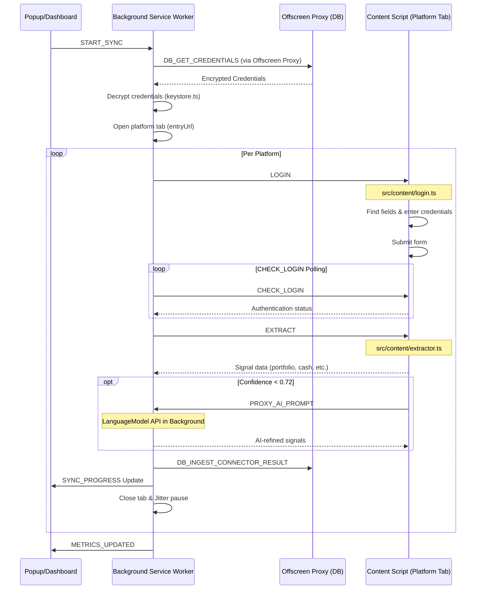

# Connector Architecture & Workflow

This document is the central reference for the scraping, login, and sync architecture of the P2P extension. It combines the previous documents `connector-architecture.md` and `connector_workflow.md`.

## Scope

- **Product**: Chrome Extension (Manifest V3), purely local processing.
- **Platforms**: Declaratively defined in `src/shared/platforms/platform-catalog.json`.
- **Extracted Signals**:
  - `portfolio_value` (Required)
  - `free_cash` (Required)
  - `net_annual_return` (Optional)

## Core Invariants

- **Jitter**: 1.5s – 3.5s between platforms.
- **Keyboard Simulation**: 50ms – 100ms delay per keystroke.
- **Isolation**: Shadow DOM for UI overlays (prevents CSS leakage to target pages).
- **No Backend**: Execution exclusively in the browser.
- **DOM Interaction** only happens in Content Scripts, never in the Background.
- **Controlled Concurrency**: Default remains sequential. Optionally, up to 2 platforms can run in parallel, with guardrails for 2FA/Captcha.
- **Encryption**: Credentials are encrypted at rest and are only decrypted during the sync execution.

## Runtime Topology

```
UI (Popup / Dashboard)
  |  chrome.runtime.sendMessage
  v
Background Service Worker (ESM)
  |  chrome.tabs.sendMessage (to Content Script)
  |  chrome.runtime.sendMessage (to Offscreen Proxy)
  +--> Content Script (IIFE, in platform tab)
  +--> Offscreen Document (DB Proxy)
         |
         v
       IndexedDB (Dexie v4)
```

- **UI** (`popup` / `dashboard`) sends control messages.
- **Background Service Worker** orchestrates sync runs, persistence, and AI proxy. Never accesses the DB directly.
- **Offscreen Document** (`db-proxy.ts` / `src/offscreen/index.ts`) receives messages from the Background and reads/writes to Dexie.
- **Content Script** in platform tabs performs login and extraction.
- **IndexedDB** (Dexie) stores sync state, metrics, credentials, and settings.
- **Dashboard State** is managed via a Zustand store (`src/dashboard/store.ts`).

## Workflow Diagram



## Involved Files

| Component | File | Responsibility |
| :--- | :--- | :--- |
| **Orchestration** | `src/background/sync.ts` | Sync logic and lifecycle management |
| **Orchestration** | `src/background/index.ts` | Message listeners, Alarms, AI proxy |
| **Debug Logging** | `src/background/sync/debug-logger.ts` | Structured debug logging for sync runs |
| **Security** | `src/background/keystore.ts` | Key management, session key persistence |
| **Automation** | `src/content/login.ts` | Fill and submit login forms |
| **Extraction** | `src/content/extractor.ts` | Heuristic-based data extraction from the DOM |
| **AI Extraction** | `src/content/ai-extractor.ts` | AI fallback via Chrome LanguageModel API |
| **AI Shared** | `src/content/ai-shared.ts` | AI proxy client (forwards requests to Background) |
| **Messages** | `src/shared/messages.ts` | Typed message contracts and `sendBackground()` helper |
| **Database** | `src/shared/db/index.ts` | Dexie schema, sync run helpers, data pruning |
| **DB Proxy** | `src/offscreen/index.ts` & `db-proxy.ts` | Offscreen Document and Background wrapper for safe IndexedDB access |
| **Scoring** | `src/shared/scoring.ts` | Confidence calculation |
| **Catalog** | `src/shared/platforms/platform-catalog.json` | Declarative platform configuration |
| **Types** | `src/shared/types/index.ts` | All shared TypeScript interfaces |
| **Dashboard Store** | `src/dashboard/store.ts` | Zustand-based UI state |

## Message Contracts

### UI -> Background (`chrome.runtime.sendMessage`)

| Message | Purpose |
| :--- | :--- |
| `START_SYNC` | Start a sync run |
| `GET_SYNC_STATUS` | Query current sync status |
| `GET_METRICS` | Query stored metrics |
| `SAVE_CREDENTIALS` / `DELETE_CREDENTIALS` | Manage credentials |
| `GET_CREDENTIAL_STATUS` | Check which platforms have credentials |
| `GET_SETTINGS` / `SAVE_SETTINGS` | Read/write settings |
| `SETUP_MASTER_PASSWORD` / `UNLOCK` / `LOCK` / `GET_LOCK_STATUS` | Master password management |
| `GET_GEMINI_STATUS` / `TRIGGER_GEMINI_DOWNLOAD` | Gemini model status |
| `PROXY_CHECK_AI` | Check AI availability (via Background) |
| `PROXY_AI_PROMPT` | Execute AI prompt (via Background) |

Typed Response Map: `BackgroundMessageMap` in `src/shared/messages.ts`. Type-safe sending via `sendBackground<T>()`.

### Background -> Offscreen Document (`chrome.runtime.sendMessage`)

The Offscreen Document acts as a strict proxy for all IndexedDB accesses. The Background Service Worker uses the types from `DbProxyMessageType` (`src/shared/db-messages.ts`) for this and wraps them in the `db-proxy.ts` helper functions via `withOffscreenLease("db")`. 
(e.g., `DB_GET_CREDENTIALS`, `DB_INGEST_CONNECTOR_RESULT`, `DB_UPDATE_SYNC_RUN`, etc.)

### Background -> UI

- `SYNC_PROGRESS` — Progress updates during sync
- `METRICS_UPDATED` — Signal to refresh metrics

### Background -> Content (`chrome.tabs.sendMessage`)

- `LOGIN` — Fill out login form
- `CHECK_LOGIN` — Check authentication status
- `EXTRACT` — Heuristic signal extraction
- `EXTRACT_AI` — AI fallback extraction
- `CAPTURE_HTML` — HTML snapshot (debug mode only)
- `DETECT_LOGIN_FIELDS` — Detect login fields

## Sync Lifecycle

For each platform in `runSync()`:

1. **Decrypt credentials** (Background, via `keystore.ts`).
2. **Open inactive tab** on platform `entryUrl`.
3. **Wait for initial page load** (`PAGE_TIMEOUT_MS = 15000`).
4. **Send `LOGIN`** to Content Script.
5. **Verify login** via `CHECK_LOGIN` polling:
   - Verification window: `LOGIN_VERIFY_TIMEOUT_MS = 20000`
   - Poll interval: `LOGIN_VERIFY_POLL_MS = 1500`
   - Settle delay after navigation: `POST_NAV_SETTLE_MS = 2000`
6. **Extract signals** sequentially with `EXTRACT`.
7. **AI Fallback** for low confidence (`< 0.72`) via `EXTRACT_AI`.
8. **Persist `ConnectorSyncResult`** in Dexie.
9. **Close tab**.
10. **Apply Jitter** before next platform (1500ms – 3500ms, omitted after the last one).

### Content Script Auto-Injection

If `sendToTab()` receives a `Could not establish connection` error, the Content Script is injected once programmatically via `chrome.scripting.executeScript()` and the message dispatch is retried. Tab diagnostics (URL, Status) are logged on errors.

### Timer Handling

`sendToTabWithTimeout()` cleans up the timeout timer in the `finally` block to avoid timer leaks.

### Sync Run Persistence

- `activeSyncRunId` is stored in `chrome.storage.session` (survives SW restarts).
- `platformProgress` is a native `Record<PlatformId, PlatformSyncState>` object (no longer a JSON string).
- DB Schema v3 migrates old JSON string entries automatically.

## Concurrency

Current production behavior:

- Within a platform: **sequential**.
- Across multiple platforms: **sequential by default**.
- Optional Parallel Sync runs at most two platforms concurrently, with staggered starts.
- A 2FA or Captcha detected during the parallel first pass is deferred and handled sequentially after the queue, so manual action never competes across platforms.

Parallel Sync is an explicit user setting because it can increase bot-detection risk and make platform windows less predictable. Cancellation, safe-mode, and per-platform sequencing remain enforced in both modes.

## Login Subsystem

Implemented in `src/content/login.ts`:

- Finds visible username/password fields via platform selectors.
- **Input Modes**:
  - `fillInputNative` — fast filling
  - `typeWithDelay` — stealth typing (50–100ms key delay)
- **Submit** via button selector or Enter fallback.
- **`CHECK_LOGIN`** determines status based on:
  - Negative Auth indicators (`/login`, `/sign-in`, Captcha/Challenge)
  - OTP field presence
  - Post-login indicators (`CSS` or `text=/regex/flags` pattern)
  - Optional positive URL hints (`/overview`, `/dashboard`, `/portfolio`)

## Heuristic Extraction

Implemented in `src/content/extractor.ts`:

1. Traverses up to 6000 DOM nodes.
2. Ignores hidden/script/style/template nodes.
3. Parses localized numbers (`1.234,56`, `1,234.56`, etc.).
4. Builds candidate context from neighbor/parent/sibling text and ARIA labels.
5. Scores candidates using keyword and type heuristics.
6. Keeps top candidates (`score > 0`, max 30).
7. Calculates confidence from score margin (`computeConfidence`).

### Confidence Formula (`src/shared/scoring.ts`)

- `margin = top - second` (or `top` if no second candidate)
- `raw = 0.45 + max(0, margin) * 0.12`
- Capped at `[0, 1]`

## AI Fallback

Implemented in `src/content/ai-extractor.ts` and `src/content/ai-shared.ts`:

- Triggered only on low heuristic confidence.
- Uses Chrome `LanguageModel` API — **via Background Proxy** (not directly in Content Script).
- **Proxy Architecture**: Content Script sends `PROXY_CHECK_AI` / `PROXY_AI_PROMPT` to Background, which creates and manages the LanguageModel session.
- Builds snippet anchors from numeric/currency-related DOM text.
- Dedup/Filter/Token budget, then model prompt.
- Expects structured JSON response, maps to `ExtractionCandidate`.
- Timeout budget in Background: `AI_MSG_TIMEOUT_MS = 30000`.

## Persistence and Database

### Dexie Tables (`src/shared/db/index.ts`)

| Table | Key | Description |
| :--- | :--- | :--- |
| `syncRuns` | `++id, runId, state, startedAt` | Sync run log |
| `overviewMetrics` | `platformId, fetchedAt` | Current platform metrics |
| `metricsHistory` | `[platformId+date], platformId, date` | Daily metric snapshots (formerly `balanceSnapshots`) |
| `cashflows` | `++id, platformId, date, type` | Cashflow entries |
| `positions` | `++id, platformId, instrumentId, date` | Position snapshots |
| `riskEvents` | `++id, platformId, status, since` | Risk events |
| `credentials` | `platformId, updatedAt` | Encrypted credentials |
| `selectorProfiles` | `[platformId+signalKey]` | Learned CSS selectors |
| `settings` | `id` | App settings |
| `deltaLogs` | `++id, platformId, timestamp, field` | Delta change log |

**Schema Version**: 3 (v3 migrates `platformProgress` from JSON string to native object).

### Data Pruning

- Daily via Chrome Alarm (`p2p_data_cleanup`, every 24h).
- Executed by `pruneOldData()` in `src/shared/db/index.ts`.

### Platform Sync States

`pending` | `running` | `success` | `failed_login` | `failed_2fa` | `failed_captcha` | `failed_timeout` | `failed_extract`

Background emits progress events for UI rendering and final metrics refresh.

## Security Model

- **Encryption**: AES-GCM 256 (Web Crypto API).
- **Master Password Mode**: PBKDF2 (310,000 iterations) key derivation.
- **Two Key Modes**:
  1. **Invisible Key** (no master password): Random key in `chrome.storage.local`.
  2. **Derived Session Key** for master password mode.
- **Session Key Persistence**: The session key is intentionally stored as Base64 in `chrome.storage.session`. For this, the derived key must remain exportable; this allows the unlock to survive Service Worker restarts and is only deleted when the browser is closed.
- `lockSession()` is asynchronous — deletes both the in-memory key and the session storage entry.
- Portfolio metrics, history, cashflows, positions, and risk events are intentionally kept unencrypted in Dexie; credentials remain encrypted.
- Unencrypted credentials are never persisted.

## Security Audit Notes

- **Finding 2** (`extractable: true` for master password keys): currently implemented intentionally because session resume uses the exported key in `chrome.storage.session`. Switching to `false` would be a redesign, not a 1-line fix.
- **Finding 3** (Plaintext financial data in IndexedDB): accepted product trade-off for local analysis. Stored credentials remain encrypted at-rest.
- **Finding 4** (Direct comparison of verification hash): Code uses string equality, but unlock messages are restricted to internal extension UI and PBKDF2 dominates runtime. Low practical impact under current threat model.

## Keepalive and Recovery

- **Sync Keepalive Alarm**: Keeps the Service Worker alive during long sync runs.
- **Stale Sync Recovery**: On startup, it is checked if a sync run is stuck and marked as failed if necessary.

## Notes for Agents

- Keep message contracts in `src/shared/messages.ts` backwards compatible.
- Keep platform catalog declarative; platform-specific scraper forks only if necessary.
- Preserve sequential execution as the default and keep optional parallel execution capped at two platforms with manual-action guardrails.
- When changing sync timing constants, update this document in the same PR.
- Use `sendBackground<T>()` for type-safe message sending.
- Always route AI calls through the Background proxy (never directly from Content Scripts).
